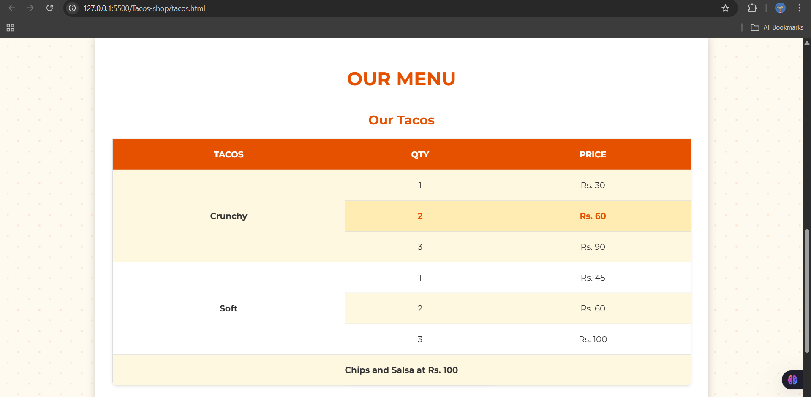

# Tacos shop

The Taco Shop Website is a personal front-end project designed to practice and showcase my web development skills. It features a clean, modern layout for a fictional taco restaurant, built entirely with HTML, CSS, and JavaScript.

# 🎯 Purpose
This project was created as a practice exercise to improve my skills in:
Responsive design
Layout structuring
Styling with CSS
Basic interactivity using JavaScript

# 🌟 Key Features
Fully responsive design for mobile and desktop

Visually appealing homepage and menu section

Smooth UI/UX with clean animations

Simple, intuitive navigation

# 🔧 Tech Stack
HTML 
CSS  
JavaScript

# Some Screenshots 

